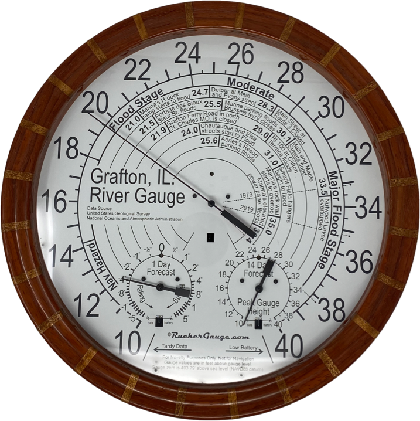

# Grafton River Gauge

Here you will find this gauge app’s source code. Gauge apps are written in node.js and run on a WallGauge.com Gauge Data Transmitter (GDT).  Gauge apps pull gauge data from a data source usually a web API on the Internet.  The data is then sent to the wall gauge for display.

## WallGauge

